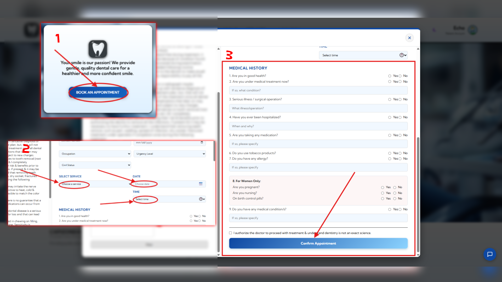

# Capizonda Dental Clinic

A modern web-based dental clinic management system for patients and staff.

## Built With

| Category | Technology |
|----------|------------|
| Backend | [Flask](https://flask.palletsprojects.com/) (Python) |
| Database & Auth | [Firebase Firestore](https://firebase.google.com/docs/firestore) & [Firebase Authentication](https://firebase.google.com/docs/auth) |
| Payments | [PayMongo](https://paymongo.com/) (GCash integration) |
| Email | [Flask-Mail](https://flask-mail.readthedocs.io/) |
| Frontend | HTML5, CSS3, JavaScript (with Dark/Light mode) |
| Deployment | [Gunicorn](https://docs.gunicorn.org/) via [Heroku](https://www.heroku.com/) (see `Procfile`) |

## What You Can Do

### For Patients
- **Register** — Create an account with email verification or sign in with Google
- **Book Appointments** — Schedule dental visits with service selection and medical history
- **View Profile** — Manage personal information, contact details, and account settings
- **View Medical Records** — Access treatment history, procedures, and payment records
- **Make Payments** — Pay for treatments via GCash
- **Dark/Light Mode** — Toggle between themes with persistent preference

### For Admin/Staff
- **Dashboard** — View and manage appointment requests
- **Approve/Decline Appointments** — Process incoming bookings
- **View Patient Records** — Access dental charts, treatment notes, and visit history
- **Export Reports** — Download dental charts as PDF

## Pages

| Page | Description |
|------|-------------|
| Home | Clinic overview and featured services |
| About | Clinic information and doctor profile |
| Services | Dental service catalog |
| Location | Clinic address and map |
| Patient Profile | Personal info and account settings |
| Medical Records | Treatment history and procedures |
| Payments | Treatment fees and payment status |

## Getting Started

### Prerequisites

- Python 3.9+
- A [Firebase project](https://console.firebase.google.com/) with a service account key
- A [PayMongo](https://dashboard.paymongo.com/) account (test mode is sufficient)
- A Google Cloud OAuth client ID
- A Gmail account for sending verification emails

### Installation

1. Clone the repository:

   ```bash
   git clone https://github.com/<your-username>/Capstone_project.git
   cd Capstone_project
   ```

2. Create and activate a virtual environment:

   ```bash
   python -m venv venv
   # Windows
   venv\Scripts\activate
   # macOS / Linux
   source venv/bin/activate
   ```

3. Install dependencies:

   ```bash
   pip install -r requirements.txt
   ```

4. Add your environment variables to a `.env` file (see [Configuration](#configuration) below).

5. Place your Firebase service account key as `dentech_key.json` in the project root.

6. Run the application:

   ```bash
   python main.py
   ```

   The server starts on `http://127.0.0.1:5000`.

### Configuration

Create a `.env` file in the project root with the following variables:

```env
SECRET_KEY=your-random-secret-key
GOOGLE_CLIENT_ID=your-google-oauth-client-id.apps.googleusercontent.com
MAIL_USERNAME=your-gmail-address@gmail.com
MAIL_PASSWORD=your-gmail-app-password
```

| Variable | Description |
|----------|-------------|
| `SECRET_KEY` | Flask session signing key (falls back to a random value if unset) |
| `GOOGLE_CLIENT_ID` | OAuth 2.0 client ID for Google Sign-In |
| `MAIL_USERNAME` | Gmail address used as the sender for verification emails |
| `MAIL_PASSWORD` | App password for the Gmail account |

### Deployment

This project is configured for Heroku. A `Procfile` is included:

```
web: gunicorn main:app
```

After setting up the Heroku CLI and adding the remote:

```bash
heroku config:set SECRET_KEY=...
heroku config:set GOOGLE_CLIENT_ID=...
heroku config:set MAIL_USERNAME=...
heroku config:set MAIL_PASSWORD=...
heroku addons:create papertrail
git push heroku main
```

> `dentech_key.json` and `.env` are in `.gitignore`. On Heroku, set sensitive values via `heroku config:set` and upload the Firebase key to the server or use a config var.

## Screenshots

| Home Page | Patient Profile |
|-----------|----------------|
|  |  |

| Medical Records | Payments |
|----------------|----------|
|  |  |

## Troubleshooting & Common Issues

This guide helps users resolve common problems. Each screenshot should include arrows pointing to the UI elements described below.

### Patient Issues

#### 1. Can't log in or sign up

**Problem:** Account access or registration fails.

**Solution:**

1. Ensure you are using the correct email address and password.
2. If using Google sign-in, make sure pop-ups are allowed in your browser.
3. Clear browser cache and cookies, then retry.
4. Check that your email is verified (look for the verification email).

     


#### 2. Appointment booking not saving

**Problem:** Submitted appointment does not appear in your records.

**Solution:**

1. Make sure all required fields are filled (date, time, service).
2. Check your medical history section is complete.
3. Refresh the page and check "My Appointments".
4. Contact the clinic if the issue persists.

    


## Contact

- **Address:** 231 Lopez Jaena St, Molo, Iloilo City
- **Phone:** 0962 687 6076
- **Email:** capizondadental@gmail.com

## Project Structure

```
Capstone_project/
├── main.py                     # Main Flask application (OOP-based)
├── main_oop.py                 # OOP exercise variant
├── requirements.txt            # Python dependencies
├── Procfile                    # Heroku deployment entry point
├── dentech_key.json            # Firebase service account key (gitignored)
├── .env                        # Environment variables (gitignored)
├── templates/                  # HTML templates
│   ├── index.html
│   ├── google_index.html
│   ├── about.html
│   ├── admin_dashboard.html
│   ├── admin_login.html
│   ├── location.html
│   ├── service.html
│   ├── patient-profile.html
│   ├── medical_records.html
│   └── prac.html
├── payment.html                # Standalone payment page
├── static/
│   ├── css/                    # Stylesheets (index-s.css, admin.css, about.css, ...)
│   └── img/                    # Images and screenshots
├── Document/
│   └── DENTECH-DOCUMENTATION.pdf
└── archive/                    # Legacy/archived files
```

## Contributing

Contributions are welcome! To contribute:

1. Fork the repository.
2. Create a new branch (`git checkout -b feature/your-feature`).
3. Make your changes.
4. Run lint / format checks if available.
5. Open a Pull Request with a clear description of the changes.

Please keep code readable, follow existing style, and never commit secrets or keys.

## License

This project is part of a capstone academic project. See the clinic's [documentation](Document/DENTECH-DOCUMENTATION.pdf) for full details. No separate license file is currently provided; contact the maintainers before using this code as a dependency.
