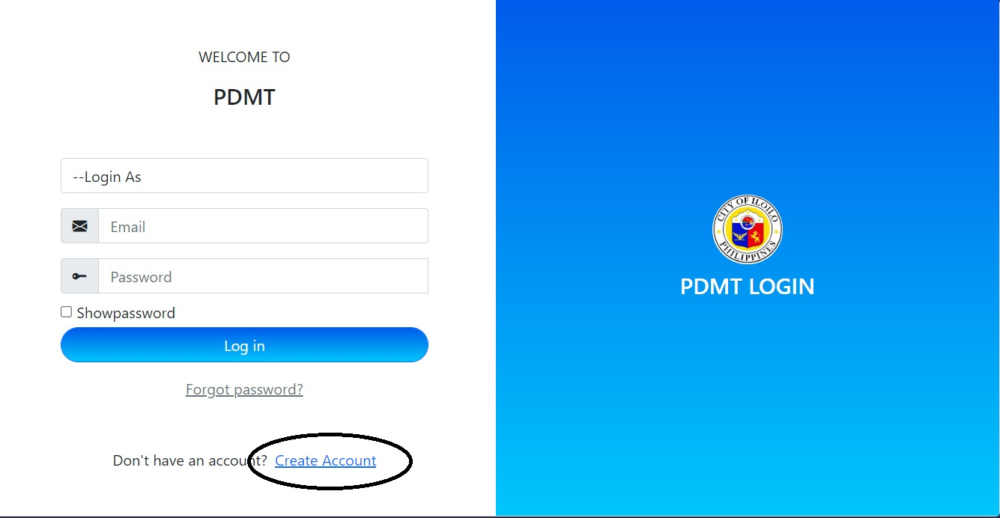
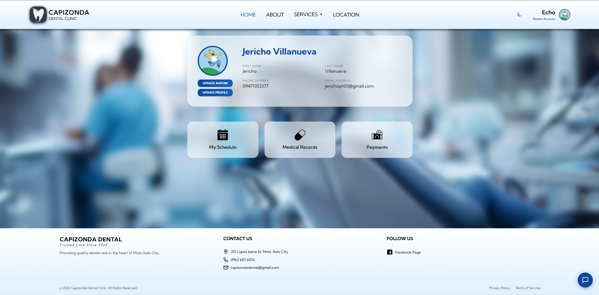
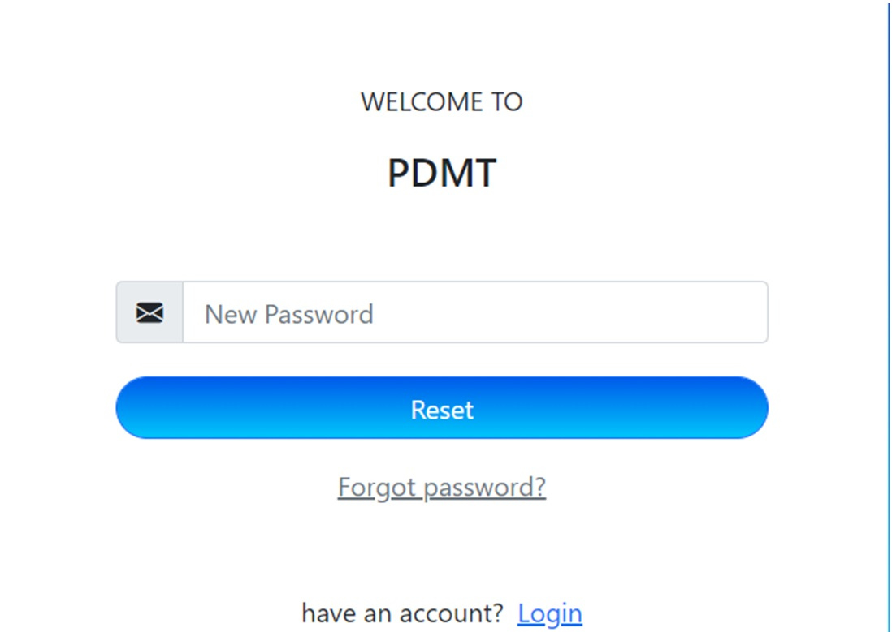
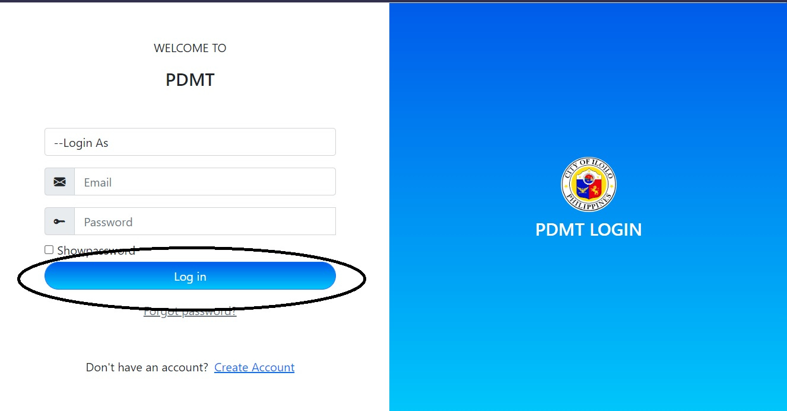
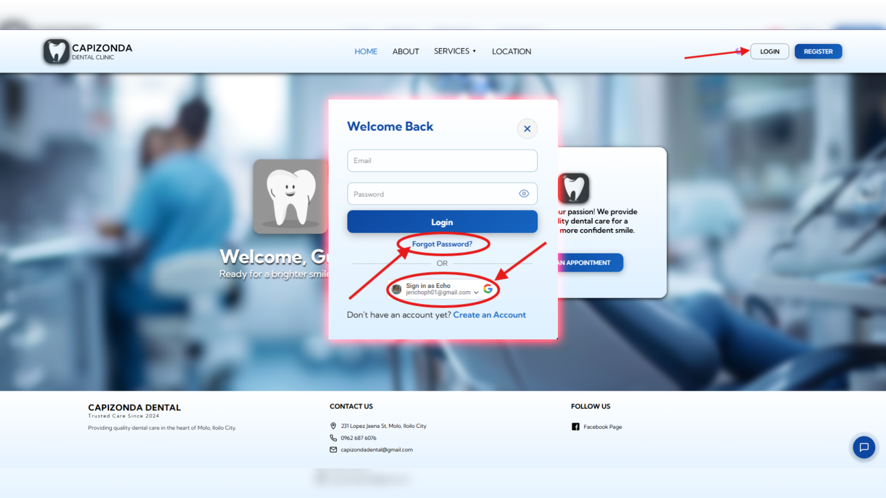

# Capizonda Dental Clinic

A modern web-based dental clinic management system for patients and staff.

## What You Can Do

### For Patients
- **Register** — Create an account with email verification or sign in with Google
- **Book Appointments** — Schedule dental visits with service selection and medical history
- **View Profile** — Manage personal information, contact details, and account settings
- **View Medical Records** — Access treatment history, procedures, and payment records
- **Make Payments** — Pay for treatments via GCash
- **Dark/Light Mode** — Toggle between themes with persistent preference

### For Admin/Staff
- **Dashboard** — View and manage appointment requests
- **Approve/Decline Appointments** — Process incoming bookings
- **View Patient Records** — Access dental charts, treatment notes, and visit history
- **Export Reports** — Download dental charts as PDF

## Pages

| Page | Description |
|------|-------------|
| Home | Clinic overview and featured services |
| About | Clinic information and doctor profile |
| Services | Dental service catalog |
| Location | Clinic address and map |
| Patient Profile | Personal info and account settings |
| Medical Records | Treatment history and procedures |
| Payments | Treatment fees and payment status |

## Getting Started

1. Visit the website
2. Register a new account or sign in with Google
3. Book your first appointment
4. View your profile and medical records

## Screenshots

| Home Page | Patient Profile |
|-----------|----------------|
|  |  |

| Medical Records | Payments |
|----------------|----------|
|  |  |

## Troubleshooting & Common Issues

This guide helps users and admins resolve common problems. Each screenshot should include arrows pointing to the UI elements described below.

### Patient Issues

#### 1. Can't log in or sign up

**Problem:** Account access or registration fails.

**Solution:**

1. Ensure you are using the correct email address and password.
2. If using Google sign-in, make sure pop-ups are allowed in your browser.
3. Clear browser cache and cookies, then retry.
4. Check that your email is verified (look for the verification email).

  

#### 2. Appointment booking not saving

**Problem:** Submitted appointment does not appear in your records.

**Solution:**

1. Make sure all required fields are filled (date, time, service).
2. Check your medical history section is complete.
3. Refresh the page and check "My Appointments".
4. Contact the clinic if the issue persists.

> **Screenshot:** `static/img/screenshots/troubleshoot_booking.png`
>
> **Arrow labels:**
> - `A` → Points to the **"Book Appointment"** button
> - `B` → Points to the **date/time picker** field
> - `C` → Points to the **service selection dropdown**
> - `D` → Points to the **medical history form** (scrollable section)
> - `E` → Points to the **"Submit"** button

#### 3. Payment not reflecting

**Problem:** GCash payment completed but status still shows "Pending".

**Solution:**

1. Take a screenshot of your GCash payment confirmation.
2. Wait 5–10 minutes for the system to update.
3. Refresh the Payments page.
4. Contact support with your payment reference number if it still shows pending.

> **Screenshot:** `static/img/screenshots/troubleshoot_payment.png`
>
> **Arrow labels:**
> - `A` → Points to the **Payments** menu item
> - `B` → Points to the **payment status badge** (Pending / Paid)
> - `C` → Points to the **"Pay Now"** / **GCash** button
> - `D` → Points to the **reference number** field

### Admin / Staff Issues

#### 4. Appointment requests not appearing

**Problem:** New patient appointments are missing from the admin dashboard.

**Solution:**

1. Confirm you are logged in with an **admin** or **staff** account.
2. Check the Dashboard tab for the latest requests.
3. Refresh the page (F5) or clear cache.
4. Verify the clinic schedule is not blocking new bookings.

> **Screenshot:** `static/img/screenshots/troubleshoot_dashboard.png`
>
> **Arrow labels:**
> - `A` → Points to the **Dashboard** link in the admin sidebar
> - `B` → Points to the **Appointment Requests** card/list
> - `C` → Points to the **Approve** and **Decline** action buttons
> - `D` → Points to the **staff role badge** (top-right or sidebar)

#### 5. PDF export failing

**Problem:** "Export PDF" button does not download the dental chart.

**Solution:**

1. Ensure pop-ups are allowed for this site.
2. Verify the patient has a complete dental chart.
3. Try a different browser (Chrome/Firefox recommended).
4. Check browser console (F12 → Console) for errors.

> **Screenshot:** `static/img/screenshots/troubleshoot_pdf.png`
>
> **Arrow labels:**
> - `A` → Points to the **Patient Records** section
> - `B` → Points to the **dental chart / tooth diagram**
> - `C` → Points to the **"Export PDF"** button
> - `D` → Points to the **download notification / pop-up blocker icon**

## Contact

- **Address:** 231 Lopez Jaena St, Molo, Iloilo City
- **Phone:** 0962 687 6076
- **Email:** capizondadental@gmail.com
